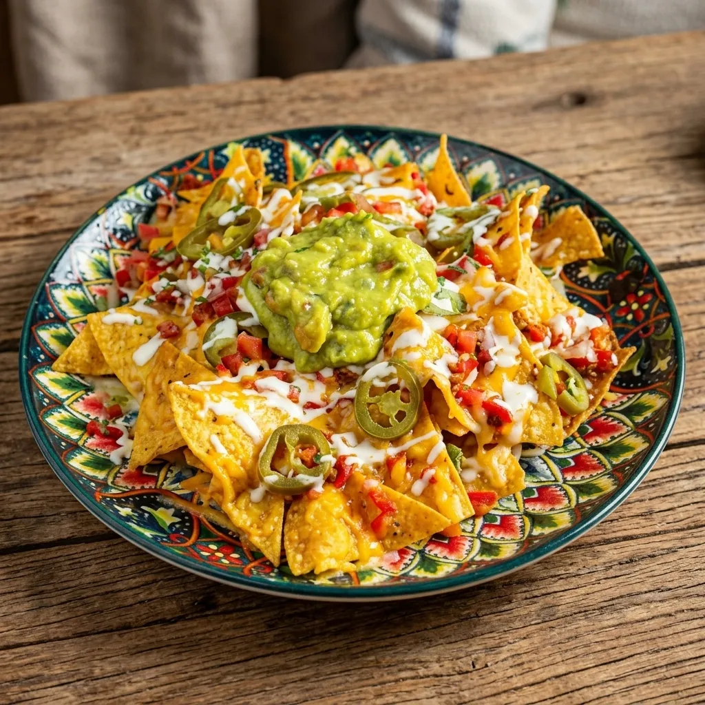

# 🌮 Buenos Mexican — Authentic Mexican Dining Experience

Welcome to the official source code for **Buenos Mexican**, a premium, high-performance restaurant website built with a "light vibe" rustic design, interactive 3D elements, and a fully automated booking ecosystem.



## 🌟 Key Features

- **Premium UI/UX**: Custom-built floating-card interface with smooth parallax, 3D perspective animations (Framer Motion), and scroll-triggered transitions.
- **iOS-Style Wheel Pickers**: A custom-built, touch-optimized "3D drum" picker for dates, times, and party sizes, offering a mobile-first native feel.
- **Automated Booking System**:
    - **Real-time DB**: Instant booking storage via Supabase.
    - **Edge Function Trigger**: Serverless logic (Deno) handles email processing on every new database entry.
    - **Branded Emails**: Professional HTML confirmation emails sent automatically via the Resend API.
- **Dynamic Content**: Daily backgrounds and specials that update based on the current day of the week.
- **Performance Optimized**: 100% WebP image assets, efficient re-renders, and mobile-specific performance adjustments (disabled heavy parallax on touch devices).

---

## 🛠️ Technology Stack

| Layer | Technology |
|---|---|
| **Frontend** | Next.js 15 (App Router), React 19, JavaScript |
| **Styling** | Vanilla CSS (Modern CSS Variables), Tailwind-ready |
| **Animations** | Framer Motion (3D & Parallax), Canvas (Particle Trails) |
| **Database** | Supabase (PostgreSQL + RLS) |
| **Serverless** | Supabase Edge Functions (TypeScript/Deno) |
| **Mailing** | Resend API |

---

## 📂 Project Structure

```bash
├── app/                  # Next.js App Router (Pages, Layouts, Globals)
├── components/           # Core UI Components
│   ├── Booking.js        # The integrated booking form
│   ├── WheelPicker.js    # Custom iOS-style UI component
│   ├── DynamicBackground.js # Logic for daily specials & imagery
│   └── SmoothScroll.js   # Global scroll physics management
├── lib/                  # Utilities & API Clients (Supabase singleton)
├── public/               # Optimized assets (WebP images, fonts)
├── supabase/             # Backend infrastructure
│   ├── functions/        # Edge Function code (Deno/TypeScript)
│   └── migrations/       # SQL for DB setup & Webhook triggers
└── deploy-edge-function.bat # Automated deployment utility
```

---

## 🚀 Setup & Deployment

### 1. Environment Variables
Create a `.env.local` file with your Supabase credentials:
```env
NEXT_PUBLIC_SUPABASE_URL=your_supabase_url
NEXT_PUBLIC_SUPABASE_ANON_KEY=your_anon_jwt_key
```

### 2. Database Setup
Execute the SQL found in `supabase/migrations/create_bookings_table.sql` in your Supabase SQL Editor. This will:
- Create the `bookings` table.
- Set up RLS (Row Level Security) for public inserts.
- Install necessary triggers.

### 3. Edge Function Deployment
Use the provided batch script to deploy the email automation:
1. Open `deploy-edge-function.bat`.
2. Add your `SUPABASE_ACCESS_TOKEN` and `RESEND_API_KEY`.
3. Run the script to link, set secrets, and deploy to the cloud.

### 4. Webhook Activation
In the Supabase Dashboard, create a **Database Webhook** on the `bookings` table for `INSERT` events, pointing to your newly deployed Edge Function.

---

## 📖 Automated Workflow Logic

1. **User Action**: Customer submits the booking form on the website.
2. **Persistence**: `Booking.js` performs a direct `.insert()` to Supabase `public.bookings`.
3. **Database Hook**: PostgreSQL fires a webhook event on successful insertion.
4. **Processing**: The `send-booking-email` Edge Function receives the record, formats the date/time, and generates a branded HTML template.
5. **Dispatch**: Resend API delivers the confirmation email to the customer's inbox.

---

## 👨‍💻 Development

Run the local development server:
```bash
npm run dev
```

Built with ❤️ by the Buenos Mexican Team.
