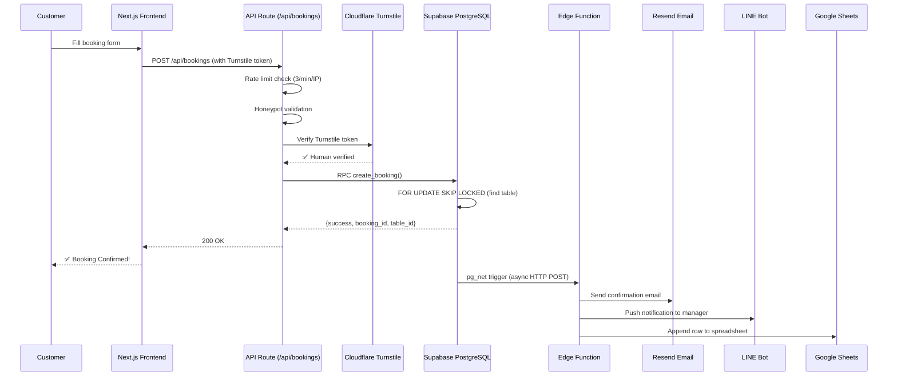
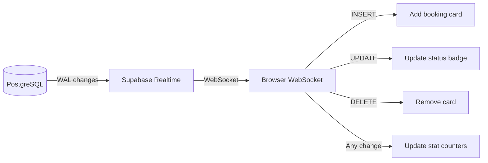
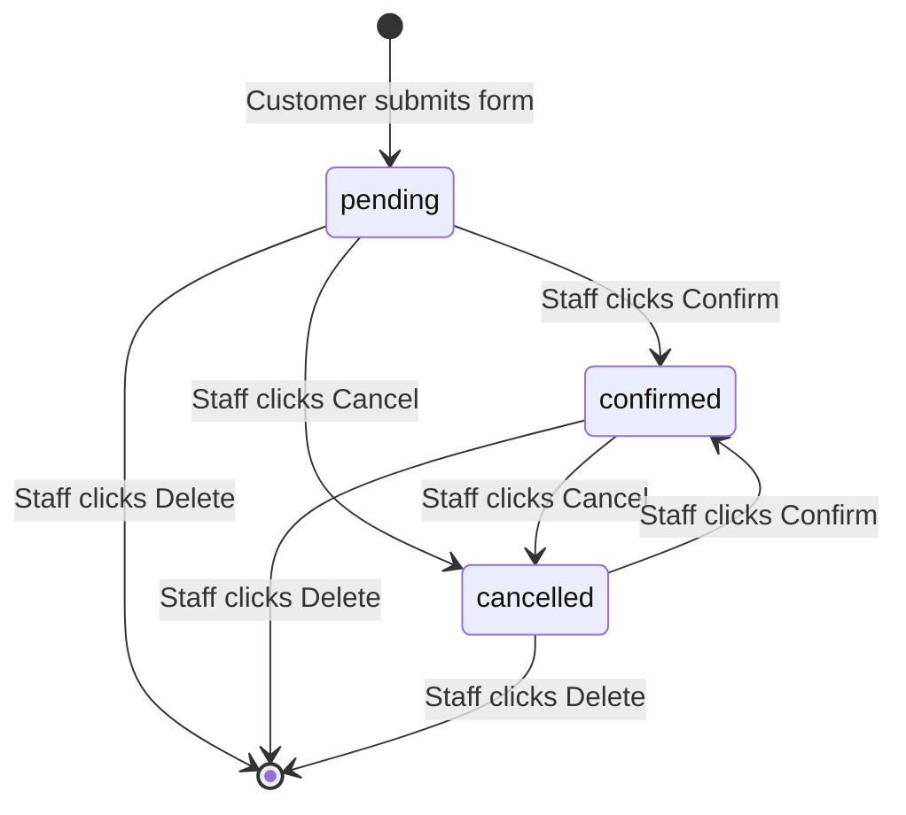
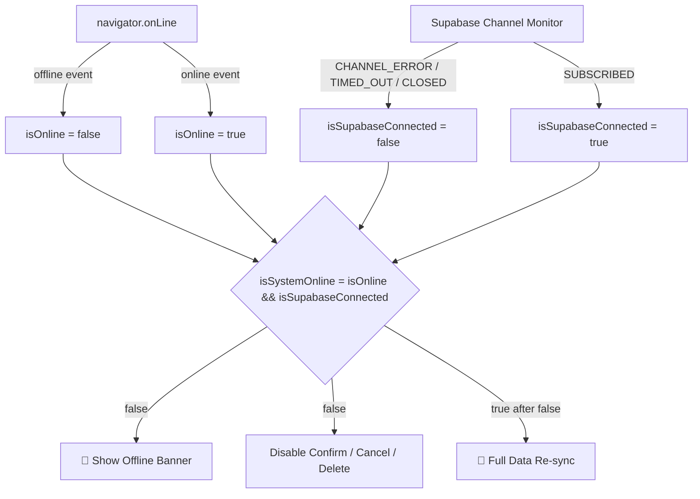
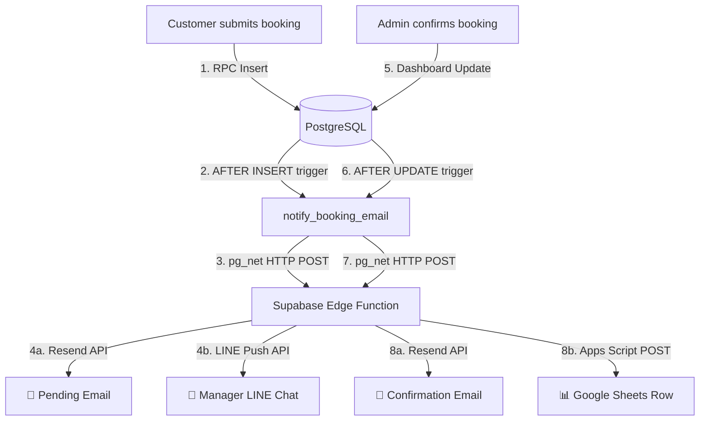

# 🌮 Buenos Mexican Cuisine — Restaurant Reservation Platform

A production-grade restaurant reservation and management system for Buenos Mexican Cuisine, Pattaya. Built on **Next.js 15** with **Supabase** for real-time PostgreSQL data, **WebSocket-driven live dashboards**, a concurrency-safe booking engine, and a multi-channel notification pipeline.

---

## 📋 Table of Contents

- [Project Overview](#-project-overview)
- [Architecture](#-architecture)
- [Feature Documentation](#-feature-documentation)
  - [1. Real-time Streaming](#1-real-time-streaming)
  - [2. Reservation Management Actions](#2-reservation-management-actions)
  - [3. Filters & Search Controls](#3-filters--search-controls)
  - [4. Interactive Statistics Cards](#4-interactive-statistics-cards)
  - [5. Smart Table Assignment (RPC)](#5-smart-table-assignment-rpc)
  - [6. Interactive Location Map](#6-interactive-location-map)
  - [7. Grab Delivery Integration](#7-grab-delivery-integration)
  - [8. Social Media & Customer Engagement](#8-social-media--customer-engagement)
- [Security & Fallback Implementations](#-security--fallback-implementations)
  - [Cloudflare Turnstile](#cloudflare-turnstile)
  - [Honeypot Field](#honeypot-field)
  - [Rate Limiting](#rate-limiting)
  - [Frontend Offline-Fallback](#frontend-offline-fallback)
- [Local Setup & Environment Variables](#-local-setup--environment-variables)
- [Database Migrations](#-database-migrations)
- [Project Structure](#-project-structure)
- [Notification Pipeline](#-notification-pipeline)

---

## 🌟 Project Overview

Buenos Mexican Cuisine is a premium restaurant platform that handles the full lifecycle of table reservations — from customer-facing booking forms to a real-time admin dashboard for restaurant staff.

### Core Tech Stack

| Layer | Technology | Purpose |
|:---|:---|:---|
| **Frontend** | Next.js 15 (App Router), React 19 | Server/client rendering, routing, API routes |
| **Database** | PostgreSQL via Supabase | Relational data, RPC functions, Row Level Security |
| **Real-time** | Supabase Realtime (WebSockets) | Live dashboard updates via WAL replication |
| **Animations** | Framer Motion, HTML5 Canvas | 3D springs, particle effects, micro-interactions |
| **Styling** | Vanilla CSS (HSL variables) | Premium design system with rustic theme |
| **Email** | Resend API | Transactional branded HTML emails |
| **Notifications** | LINE Messaging API | Instant push alerts to restaurant managers |
| **Data Sync** | Google Apps Script | Automated Google Sheets backup of reservations |
| **Security** | Cloudflare Turnstile | Invisible CAPTCHA bot protection |

---

## 🏗️ Architecture

### Booking Flow



### Admin Dashboard Real-time Flow



---

## 📚 Feature Documentation

### 1. Real-time Streaming

The admin dashboard receives live updates without polling or page refreshes, powered by Supabase Realtime Channels.

**How it works:**

1. **Write-Ahead Log (WAL)**: PostgreSQL's WAL captures every `INSERT`, `UPDATE`, and `DELETE` on the `bookings` table.
2. **Supabase Realtime**: Supabase reads the WAL and broadcasts changes over the `supabase_realtime` publication.
3. **WebSocket Channels**: The `AdminDashboard` component subscribes to the `admin-bookings` channel via `supabase.channel()`.
4. **State Updates**: Each event type triggers specific React state mutations:
   - `INSERT` → Prepends the new booking and plays an audio notification chime
   - `UPDATE` → Replaces the booking in-place (e.g., status change to `confirmed`)
   - `DELETE` → Removes the booking card with an exit animation
5. **Channel Health Monitoring**: The subscription callback tracks connection status. If the channel reconnects after a disconnect (`SUBSCRIBED` after prior connection), it triggers a **full data re-sync** to catch any events missed during the outage.

**Key files:**
- `components/AdminDashboard.js` — Channel subscriptions and state management
- `app/admin/page.js` — Connection monitoring (navigator + Supabase channel)

---

### 2. Reservation Management Actions

The admin dashboard supports three state-change actions on each booking, with distinct consequences:



| Action | Effect on Database | Effect on Table Availability |
|:---|:---|:---|
| **Confirm** | Sets `status = 'confirmed'` | Table remains occupied for the slot |
| **Cancel** | Sets `status = 'cancelled'` | Table becomes available (excluded from booking queries via `status != 'cancelled'`) |
| **Delete** | Hard deletes the row | Table becomes available immediately |

All actions are **disabled** when the system is offline (`isSystemOnline = false`), with buttons showing reduced opacity and `cursor: not-allowed`. Each action triggers the `on_booking_created` trigger, which fires the notification Edge Function to send updated status emails.

---

### 3. Filters & Search Controls

The dashboard provides three filtering mechanisms that operate client-side for instant responsiveness:

| Filter | Type | Behavior |
|:---|:---|:---|
| **Search** | Text input | Filters by `name` or `email` (case-insensitive `.includes()`) |
| **Date** | Toggle pills (`All Time` / `Today`) | Compares `booking.date` against today's ISO date |
| **Status** | Dropdown select | Matches exact `status` value (`pending`, `confirmed`, `cancelled`) |

All three filters chain together — a booking must pass all active filters to appear. The search input updates state on every keystroke via `onChange`. For production at scale, consider adding a debounce wrapper (e.g., 300ms) to reduce re-renders on rapid typing.

---

### 4. Interactive Statistics Cards

The dashboard header displays five real-time counters:

| Card | Aggregation | Source |
|:---|:---|:---|
| **Total** | `bookings.length` | Full bookings array count |
| **Confirmed** | `.filter(b => b.status === 'confirmed').length` | Status-filtered count |
| **Pending** | `.filter(b => b.status === 'pending').length` | Status-filtered count |
| **Today** | `.filter(b => b.date === today).length` | Date-filtered count |
| **VIP Subscribers** | `SELECT COUNT(*) FROM subscribers WHERE is_active = true` | Separate Supabase query |

These counters update **instantly** on every Realtime event because they are computed from the React `bookings` state array, which is mutated directly by WebSocket events. The VIP Subscribers count re-fetches from the database via a separate `admin-subscribers` Realtime channel.

---

### 5. Smart Table Assignment & Slot Capacity (RPC)

The `create_booking` PostgreSQL RPC function handles the entire booking logic atomically at the database level, preventing inconsistencies that could arise from application-level logic.

#### Slot Capacity & Sharing
- **Limit**: Only **10 bookings** are allowed per time slot on any given day.
- **Table Allocation**:
  1. The system first searches for an available, exclusive table that matches the party size (ordered by capacity, with `FOR UPDATE SKIP LOCKED`).
  2. If all matching tables are currently assigned to active bookings for that slot, but the total number of bookings is still **under 10**, the system automatically falls back to assigning a shared table to satisfy foreign key relationships.

#### Algorithm

1. **Parse party size**: Strip non-digits from `p_party_size` (e.g., `"9+"` → `9`).
2. **Check total bookings**: Count all active bookings for the requested `(date, time)`. If there are already 10 or more active bookings, the slot is full.
3. **Find smallest table**: Query active tables with `capacity >= party_size` and no existing booking for the slot, ordered by `capacity ASC`. Uses **`FOR UPDATE SKIP LOCKED`** to prevent race conditions. If none are exclusive, falls back to sharing an active table.
4. **If full** → Generate up to **4 alternative times** that have **fewer than 10 bookings**, sorted by **proximity** to the requested time (e.g., if you request 20:00, suggestions might be 20:30, 19:30, 21:00, 19:00).
5. **If available** → Insert the booking atomically and return `{success, booking_id, table_id}`.

#### Double-Booking Prevention

```
FOR UPDATE SKIP LOCKED
```

This PostgreSQL clause locks the selected table row for the duration of the transaction. If two customers request the same slot simultaneously:

- **Transaction A** locks "Table 1" and proceeds to insert.
- **Transaction B** skips "Table 1" (it's locked) and finds the next available table (or falls back to sharing if all are claimed, provided the 10 booking limit is not exceeded).
- If the 10 bookings limit is reached, Transaction B receives the `TIME_SLOT_FULL` error with alternative time recommendations.

Additionally, a `unique_violation` exception handler catches any edge case where a constraint is violated, returning a distinct `DOUBLE_BOOKING_CONFLICT` error code that the API route maps to HTTP 409.

---

### 6. Interactive Location Map

An interactive, responsive Google Maps embed is integrated to help customers easily locate the physical restaurant location.

- **Component**: [Location.js](file:///c:/Buenos%20Mexican/components/Location.js)
- **Features**:
  - Embedded Google Maps iframe pointing to the restaurant's location in Jomtien Complex, Pattaya.
  - Configured with `loading="lazy"` and `referrerPolicy="no-referrer-when-downgrade"` for performance optimization and privacy compliance.
  - Wrapped inside dynamic, hardware-accelerated `motion.div` from Framer Motion with entry transitions (`whileInView`).

---

### 7. Grab Delivery Integration

Customers can seamlessly order delivery or takeout directly via Grab Food integration.

- **Integration Links**: Prominently linked to the restaurant's Grab food profile: `https://r.grab.com/o/Zn6bI3Ar`.
- **User Interface Touchpoints**:
  - **Hero Section**: A large, customized "Order on Grab" call-to-action button with a branded green background.
  - **Menu page & Footer**: Accessible buttons in the main navigation context/footers, featuring high contrast and semantic styling (`#00B14F` branding).

---

### 8. Social Media & Customer Engagement

Active links to social channels are embedded to facilitate customer reviews, inquiries, and social media updates.

- **Facebook Profile**: Linked directly to the official Buenos Mexican Restaurant Facebook page: `https://www.facebook.com/profile.php?id=61571573732880`.
- **Instagram Profile**: Linked to the official Instagram account to showcase food visual content.
- **TikTok Profile**: Connected to the official TikTok channel for video promotions.
- **Placement**: Clean SVG iconography integrated in the shared footer layout on the landing page and menu page.

---

## 🔒 Security & Fallback Implementations

### Cloudflare Turnstile

**Purpose**: Invisible CAPTCHA that protects the booking form from automated spam without degrading user experience.

**Client-side** (`components/Reserve.js`):
- Loads the Turnstile script with `render=explicit` for manual widget control.
- Renders an invisible challenge in `#turnstile-container`.
- Captures the token via `callback` and clears it on `expired-callback` / `error-callback`.
- Blocks form submission if `turnstileToken` is empty.
- Resets the widget after submission errors.

**Server-side** (`app/api/bookings/route.js`):
- Sends the token + client IP to Cloudflare's `siteverify` endpoint.
- Rejects the request with HTTP 400 if verification fails.

**Environment variables:**
```env
NEXT_PUBLIC_TURNSTILE_SITE_KEY=<your-site-key>   # Client-side (public)
TURNSTILE_SECRET_KEY=<your-secret-key>            # Server-side only
```

---

### Honeypot Field

**Purpose**: A hidden form field invisible to human users but automatically filled by bots scanning for input fields.

**Implementation** (`components/Reserve.js`):
- A text input named `website` is positioned off-screen (`left: -9999px; top: -9999px; opacity: 0`).
- Marked with `aria-hidden="true"` and `tabIndex="-1"` to prevent screen reader / tab access.

**Server behavior** (`app/api/bookings/route.js`):
- If `website` field contains any value, the server logs the bot attempt and returns a **fake success response** (`200 OK` with mock IDs), silently dropping the request without database insertion.

---

### Rate Limiting

**Purpose**: Prevent a single IP from flooding the booking endpoint.

**Configuration**: Maximum **3 requests per minute** per IP address.

**Implementation** (`app/api/bookings/route.js`):
- Uses an in-memory `Map<string, number[]>` storing request timestamps per IP.
- On each request, expired timestamps (> 60s old) are pruned across all IPs.
- If the active count for the requesting IP ≥ 3, responds with HTTP 429.
- IP is extracted from `x-forwarded-for` → `x-real-ip` → fallback `127.0.0.1`.

> **Note**: This is an in-memory rate limiter suitable for single-instance deployments. For multi-instance or serverless production environments, consider upgrading to a Redis-backed solution (e.g., Upstash Rate Limit).

---

### Frontend Offline-Fallback

**Purpose**: Gracefully handle network outages in the admin dashboard to prevent data corruption from failed mutations.

**Architecture:**



**Layers of detection:**
1. **Browser API**: `navigator.onLine` + `online`/`offline` window events
2. **Supabase Channel**: A dedicated `connection-monitor` channel subscription tracking `SUBSCRIBED`, `CHANNEL_ERROR`, `TIMED_OUT`, and `CLOSED` states
3. **Channel-level re-sync**: The `admin-bookings` channel itself triggers a full `fetchBookings()` when it transitions back to `SUBSCRIBED` after a prior disconnect

**When offline (`isSystemOnline = false`):**
- A prominent red gradient alert banner appears at the top of the viewport
- All action buttons (Confirm, Cancel, Delete) are disabled with `opacity: 0.45` and `cursor: not-allowed`
- The status indicator dot in the header pulses red

**When reconnected:**
- Dashboard automatically calls `fetchBookings()` and `fetchSubscribersCount()` to re-sync stale data
- A green success toast confirms: "🔄 Network restored. Data re-synced."

---

## 🚀 Local Setup & Environment Variables

### 1. Prerequisites
- Node.js 18+
- npm 9+
- A Supabase project ([supabase.com](https://supabase.com))
- Cloudflare Turnstile keys ([dash.cloudflare.com](https://dash.cloudflare.com))

### 2. Clone & Install

```bash
git clone <repository-url>
cd buenos-mexican
npm install
```

### 3. Environment Configuration

Create a `.env.local` file in the project root:

```env
# ── Supabase ──────────────────────────────────────
NEXT_PUBLIC_SUPABASE_URL=https://your-project-ref.supabase.co
NEXT_PUBLIC_SUPABASE_ANON_KEY=your-supabase-anon-jwt-key

# ── Cloudflare Turnstile ──────────────────────────
NEXT_PUBLIC_TURNSTILE_SITE_KEY=your-turnstile-site-key       # Public (client-side)
TURNSTILE_SECRET_KEY=your-turnstile-secret-key               # Private (server-side only)

# ── Notification Pipeline (Edge Function Secrets) ─
RESEND_API_KEY=re_your_resend_api_key
LINE_CHANNEL_ACCESS_TOKEN=your-line-bot-channel-access-token
LINE_MANAGER_USER_ID=Uyour-line-manager-user-id
GOOGLE_SHEET_WEBHOOK_URL=https://script.google.com/macros/s/your-script-id/exec

# ── Site ──────────────────────────────────────────
NEXT_PUBLIC_SITE_URL=http://localhost:3000
```

> **⚠️ Test Keys**: Cloudflare provides test keys for development:  
> Site Key: `1x00000000000000000000AA` / Secret: `1x0000000000000000000000000000000AA`  
> These always pass verification. Replace with production keys before deployment.

### 4. Database Setup

Run migration files in your **Supabase SQL Editor** in order (see [Database Migrations](#-database-migrations) below).

### 5. Deploy Edge Function Secrets

```bash
npx supabase secrets set --project-ref your-project-ref \
  RESEND_API_KEY="re_your_key" \
  LINE_CHANNEL_ACCESS_TOKEN="your_token" \
  LINE_USER_ID="your_user_id" \
  GOOGLE_SHEET_WEBHOOK_URL="your_url"
```

### 6. Run Locally

```bash
npm run dev          # Development server at http://localhost:3000
npm run build        # Production build
npm run start        # Start production server
```

---

## 🗄️ Database Migrations

Run these SQL files in your Supabase SQL Editor **in chronological order**:

| File | Purpose |
|:---|:---|
| `00_init.sql` | Enable `pg_net` and `pg_cron` extensions; set global config |
| `01_schema.sql` | Create `tables`, `customers`, `bookings` tables; seed 9 physical tables; add indexes |
| `02_security.sql` | Enable Row Level Security (RLS); define policies for anon, authenticated, staff/admin |
| `03_business_logic.sql` | Create `notify_booking_email()` trigger function; create `on_booking_created` trigger |
| `04_booking_capacity.sql` | Deploy `create_booking` RPC with capacity checking, `FOR UPDATE SKIP LOCKED`, and alternative time generation |
| `05_newsletter_subscribers.sql` | Create `subscribers` table with RLS policies |
| `06_anon_booking_management.sql` | Allow anonymous users to manage bookings (development/staging only) |
| `07_anon_newsletter_management.sql` | Allow anonymous users to manage subscribers (development/staging only) |
| `08_email_tracking.sql` | Create `email_blasts` and `email_logs` tables for newsletter campaign tracking |

> **Production Note**: Migrations `06` and `07` grant anonymous full access for development convenience. In production, the admin dashboard should be protected behind authentication, and these policies should be removed or restricted.

---

## 📂 Project Structure

```
buenos-mexican/
├── app/                          # Next.js 15 App Router
│   ├── admin/
│   │   └── page.js               # Admin dashboard page (offline detection, tab navigation)
│   ├── api/
│   │   ├── bookings/
│   │   │   └── route.js          # POST handler (rate limit → honeypot → Turnstile → RPC)
│   │   ├── email-webhook/        # Resend webhook for delivery tracking
│   │   ├── newsletter/           # Newsletter send API
│   │   └── unsubscribe/          # Newsletter unsubscribe API
│   ├── menu/                     # Menu explorer page
│   ├── globals.css               # Design system (HSL variables, typography, layouts)
│   ├── layout.js                 # Root layout with fonts and metadata
│   └── page.js                   # Landing page (Hero, Menu, Salsas, Booking, Location)
├── components/
│   ├── AdminDashboard.js         # Real-time booking cards, stats, filters, actions
│   ├── DynamicBackground.js      # Interactive canvas particle trail
│   ├── Hero.js                   # Landing hero section with CTA
│   ├── Location.js               # Contact info, Google Maps, operating hours
│   ├── MenuCategories.js         # Infinite swiper carousel
│   ├── Navbar.js                 # Responsive navigation with mobile drawer
│   ├── NewsletterAdmin.js        # Newsletter campaign management dashboard
│   ├── NewsletterModal.js        # Newsletter subscription modal
│   ├── ParticleTrail.js          # Cursor-following particle physics
│   ├── Reserve.js                # Booking form (Turnstile + Honeypot + Wheel Pickers)
│   ├── Reviews.js                # Customer testimonials section
│   ├── Salsas.js                 # 3D tilt cards with coordinate springs
│   ├── SmoothScroll.js           # Lenis smooth scroll wrapper
│   ├── Specials.js               # Daily specials section
│   ├── VipFooterButton.js        # Floating VIP action button
│   └── WheelPicker.js            # iOS-style 3D drum picker (date/time/party)
├── lib/
│   ├── menu-data.js              # Restaurant menu items database
│   └── supabase.js               # Supabase client singleton
├── supabase/
│   ├── functions/
│   │   └── send-booking-email/   # Deno Edge Function (Email + LINE + Sheets)
│   └── migrations/               # 9 SQL migration files (see table above)
├── .env.local                    # Environment variables (not committed)
├── package.json                  # Dependencies and scripts
└── README.md                     # This file
```

---

## 📡 Notification & Sync Pipeline

When a booking is created or its status changes, a PostgreSQL trigger fires an asynchronous HTTP POST to a Supabase Edge Function, which distributes notifications and synchronizes data across external channels:



- **Non-blocking**: `pg_net` makes the HTTP call asynchronously, so the booking insert returns immediately.
- **Edge Function**: Written in TypeScript/Deno, deployed on Supabase's global edge network.
- **Resend Email**: Sends status-specific emails to customers (e.g. pending notification upon reservation, confirmation email upon approval).
- **LINE Bot**: Sends summary cards to the restaurant manager's LINE chat for instant awareness of new booking requests.
- **Google Sheets**: **Only synchronizes confirmed bookings**. When the administrator approves a booking in the Admin Dashboard, the Edge Function triggers the Google Sheets Webhook to append a row. This completely eliminates execution overhead for pending/unapproved requests.

---

Built with ❤️ by the Buenos Mexican Cuisine Development Team.
