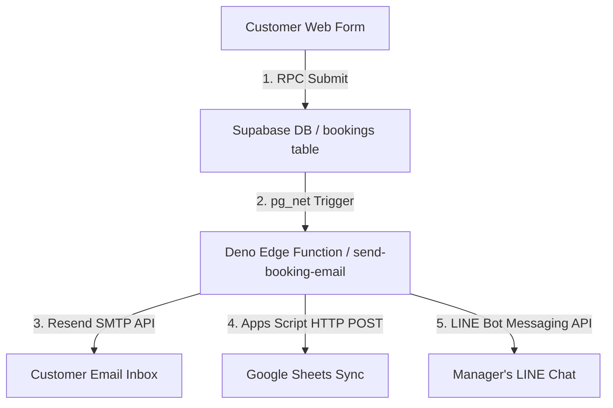

# 🌮 Buenos Mexican Cuisine — Premium Restaurant Platform

Welcome to the production repository of **Buenos Mexican Cuisine**, a state-of-the-art, high-performance web platform for Pattaya's premium authentic Mexican restaurant. This platform is meticulously engineered using a "light-vibe" rustic design language, seamless 3D spatial interactions, a real-time reactive Admin Dashboard, and a fully automated, concurrency-resistant table booking engine.

---

## 🌟 Platform Feature Deep-Dive

### 1. Interactive Premium UI/UX & Dynamic Aesthetics
The user experience is tailored to feel alive, warm, and highly premium, avoiding generic design patterns in favor of rich visual depth:
*   **Dynamic Theme System**: Anchored on modern CSS variables with custom HSL tailored colors: Deep Brick Red (`--primary`), Rustic Green (`--secondary`), Warm Cream (`--background`), and Translucent Glass (`--surface`).
*   **3D Salsas Section with Coordinate Springs**: The Salsas cards feature a highly reactive 3D tilt effect using `framer-motion`'s `useMotionValue`, `useSpring`, and `useTransform`. It tracks mouse movement coordinates in real-time, rotating card layers and projecting images outwards in 3D space (`translateZ`).
*   **Interactive Particle Canvas**: Custom-built background rendering that casts interactive, physics-driven particle trails trailing the user's cursor for a magical feel.
*   **Autoloop Categories Swiper**: Features a linear infinite Swiper carousel (Tacos, Burritos, Quesadillas, Desserts, Margaritas) that smoothly loops without friction, featuring glassmorphism overlays and dashed rustic borders.
*   **Custom Typography**: Clean loading of Google Fonts (`Alfa Slab One` for primary headers, `Bree Serif` for script headers, and `Montserrat` for body copy), customized with soft gold/crimson text glows and text shadows.

### 2. High-Performance Concurrency-Controlled Booking Engine
The reservation system is designed to handle high transaction volumes and ensure zero data loss during rush hours:
*   **PostgreSQL Atomic RPC (`create_booking`)**: Instead of basic database writes, the platform invokes a custom PostgreSQL RPC function in the backend. It uses strict concurrency control to lock records, assign unique table IDs, and execute atomic transactions, returning safe, serialized responses back to the client.
*   **iOS-Style 3D Wheel Pickers**: An elegant, native-feeling custom drum picker for Dates, Times, and Party Sizes. Built using CSS scroll snapping (`scroll-snap-type: y mandatory`), 3D item perspective rotations (`rotateX`), and state debouncing to keep parent React state updates lightweight and performant.

### 3. Fully Automated Real-Time Notifications Pipeline
The reservation engine triggers an automated, multi-channel notification and logging pipeline instantly upon booking creation using Postgres database webhooks:



*   **Non-Blocking Webhook Push (`pg_net`)**: When a booking is inserted or updated, a Postgres trigger executes the `notify_booking_email()` function. It leverages Supabase's high-performance `pg_net` extension to make asynchronous, non-blocking `net.http_post` requests to the cloud Edge Function.
*   **Serverless Deno Edge Function**: Hosted on Supabase's global edge network, this TypeScript-written serverless function coordinates the distribution of transactional actions.
*   **Resend Branded HTML Mailer**: Renders beautiful, clean HTML email templates sent to customers immediately, containing confirmation headers, booking details, and location maps.
*   **LINE Messaging Bot integration**: Connects with the LINE Push API, instantly delivering reservation summary cards directly to the manager's LINE chat with emoji-coded statuses so staff can prep tables in advance.
*   **Real-Time Google Sheets Webhook Sync**: Executes a secure POST request to a custom Google Apps Script Web App. The script handles Google's automatic `302 Redirect` behavior, receives the booking JSON, formats the timestamps, and appends a clean row to the **"Buenos Mexican Bookings"** spreadsheet in under 50ms.

### 4. Reactive Live Admin Dashboard
An ultra-premium, real-time control center for restaurant managers to oversee reservations without refreshing pages:
*   **Postgres Replication Streams**: Directly connects to the Supabase PostgreSQL replication channel via web sockets, capturing `INSERT`, `UPDATE`, and `DELETE` events instantly.
*   **Audio Chime Notifications**: Plays a warm notification sound automatically when a new customer completes a booking, ensuring staff never miss walk-ins.
*   **Status Management Controls**: Allows managers to instantly transition bookings between `pending`, `confirmed`, and `cancelled` states with color-coded left indicator bars and smooth transition animations.
*   **Advanced Filtering**: One-click toggles between viewing all reservations and showing today's bookings only.

---

## 🛠️ Technology Architecture

| Stack Layer | Technologies | Purpose |
| :--- | :--- | :--- |
| **Core Frontend** | Next.js 15 (App Router), React 19, JS | High-speed rendering & modular UI components |
| **Animations** | Framer Motion, HTML5 Canvas | Smooth 3D coordinate springs & particle physics |
| **Styling** | Vanilla CSS (Modern CSS Variables) | Premium custom layouts, dashed styling, typography |
| **Database** | PostgreSQL (Supabase) | High-performance relational data storage |
| **Serverless Logic** | Deno runtime, TypeScript | Cloud Edge Function dispatch |
| **Mailing Client** | Resend API | Transactional branded email dispatch |
| **Sheet Integrations**| Google Apps Script Web App | Instant booking synchronization to Google Drive |
| **Chat Bot** | LINE Messaging Push API | Instant manager notifications |

---

## 📂 Project Structure

```bash
├── .vscode/               # Editor configurations & Deno environment settings
├── app/                  # Next.js App Router
│   ├── admin/            # Secure live booking management route
│   ├── menu/             # Premium detailed menu explorer
│   ├── globals.css       # Dynamic typography, HSL theme, layout classes
│   └── layout.js         # Global structural wrappers & analytics
├── components/           # Modular visual components
│   ├── AdminDashboard.js # Real-time replication dashboard
│   ├── DynamicBackground.js # Interactive canvas particle trail & dynamic backgrounds
│   ├── Hero.js           # Header 3D titles and quick CTA buttons
│   ├── Location.js       # Contact info, Google Maps profile links, operating hours
│   ├── MenuCategories.js # Linear swiper carousel for quick menu navigation
│   ├── Navbar.js         # Mobile-drawer scrolling navigation header
│   ├── Reserve.js        # Reservation form layout with RPC trigger
│   ├── Salsas.js         # 3D Tilt cards and responsive mobile float-on-top layout
│   └── WheelPicker.js    # iOS-style 3D drum selection wheels
├── lib/                  # Configurations & client singletons
│   ├── menu-data.js      # Consolidated database of restaurant offerings
│   └── supabase.js       # Initialized Supabase client instance
├── supabase/             # Backend operations folder
│   ├── functions/        # Serverless Deno Edge Function files
│   └── migrations/       # Schema, RLS, and webhook business logic
└── README.md             # Platform documentation
```

---

## 🚀 Setup & Local Development

### 1. Environment Configurations
Create a `.env.local` file in the root directory:
```env
NEXT_PUBLIC_SUPABASE_URL=https://your-project-ref.supabase.co
NEXT_PUBLIC_SUPABASE_ANON_KEY=your-anon-jwt-token
GOOGLE_SHEET_WEBHOOK_URL=https://script.google.com/macros/s/your-script-id/exec
```

### 2. Database Migrations
Run the migration SQL scripts in your Supabase SQL editor in chronological order:
*   `00_init.sql`: Sets up base extensions (like `pg_net` for webhooks).
*   `01_schema.sql`: Initializes the `bookings` table, default constraints, and index optimizations.
*   `02_security.sql`: Activates Row Level Security (RLS) and sets granular insert policies.
*   `03_business_logic.sql`: Deploys the concurrency-safe `create_booking` RPC, creates HTTP webhook triggers, and ties inserts to the edge function pipeline.

### 3. Deploying Cloud Secrets
To update edge function keys on your live Supabase cloud workspace, deploy them using the Supabase CLI:
```bash
npx supabase secrets set --project-ref your-project-ref LINE_CHANNEL_ACCESS_TOKEN="token" LINE_USER_ID="id" RESEND_API_KEY="re_key" GOOGLE_SHEET_WEBHOOK_URL="url"
```

### 4. Running the Project Locally
Start the Next.js development server:
```bash
npm run dev
```
Build the optimized production package:
```bash
npm run build
```

---

Built with ❤️ by the Buenos Mexican Cuisine Development Team.
